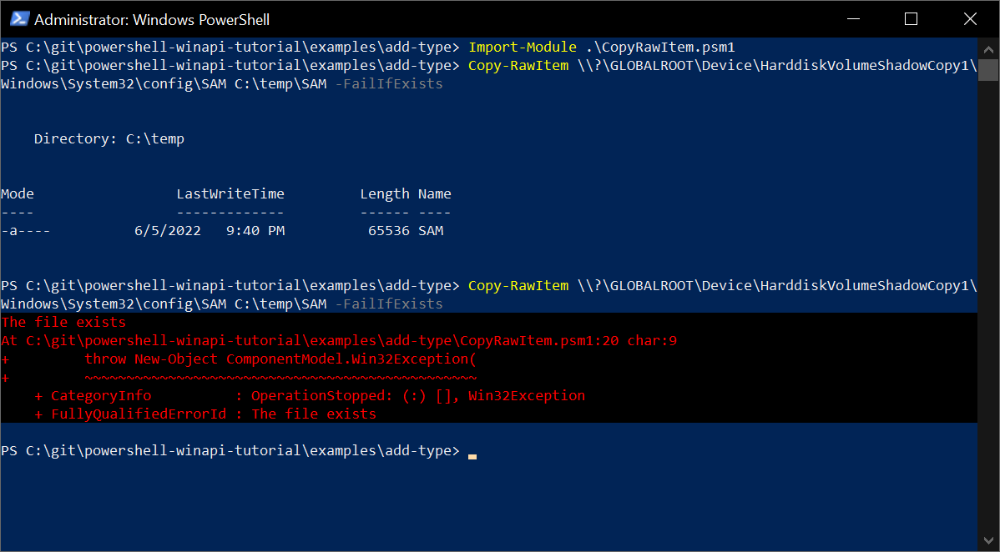

# Введение

Этот проект документации основан на серии статей Мэтта Гребера:

* [Use PowerShell to Interact with the Windows API: Part 1](https://devblogs.microsoft.com/scripting/use-powershell-to-interact-with-the-windows-api-part-1/)
* [Use PowerShell to Interact with the Windows API: Part 2](https://devblogs.microsoft.com/scripting/use-powershell-to-interact-with-the-windows-api-part-2/)
* [Use PowerShell to Interact with the Windows API: Part 3](https://devblogs.microsoft.com/scripting/use-powershell-to-interact-with-the-windows-api-part-3/)

Здесь вы найдете инструкции и примеры доступа к [Windows API](https://docs.microsoft.com/ru-ru/windows/win32/apiindex/windows-api-list) (Win32 API) из сценариев на [PowerShell](https://docs.microsoft.com/ru-ru/powershell/). Рассматривается альтернативных способов вызова функции [CopyFile](https://docs.microsoft.com/en-us/windows/win32/api/winbase/nf-winbase-copyfile) и демонстрируется создание модуля PowerShell предоставляющего командлет `Copy-RawItem`. Этот коммандлет отличается от стандартного [Copy-Item](https://docs.microsoft.com/ru-ru/powershell/module/microsoft.powershell.management/copy-item) тем что он может обрабатывать специальные пути к объектам устройств. Например это могут быть пути пути к файлам, сохраненным [cлужбой теневого копирования томов](https://docs.microsoft.com/ru-ru/windows/win32/vss/volume-shadow-copy-service-portal): 

`\\?\GLOBALROOT\Device\HarddiskVolumeShadowCopy1_`

Также демонстрируется обработка ошибок, которые могут быть выданы вызванным методом Win32 API.

Доступ к `CopyFile` рассматривается в качестве простого базового примера. Вы можете использовать аналогичный подход для доступа к другим Win32 API.

## Содержание

* [Три способа вызвать метод Win32 API](win32-approaches/index.md)
    * [Использование коммандлета Add-Type для вызова функции Win32 API](win32-approaches/add-type.md)
    * [Получение приватного .NET метода вызывающего функцию Win32 API](win32-approaches/private-method.md)
    * [Вызов функции Win32 API из динамически определенного метода](win32-approaches/reflection.md)
* [Заключение](summary.md)

!!! note "Примечание"

    Некоторые разделы еще не закончены, контент дорабатывается.

## Примеры кода

Примеры из этой документации доступны на GitHub: [powershell-winapi-tutorial/examples/](https://github.com/konstantinbelyakov/powershell-winapi-tutorial/tree/main/examples/).