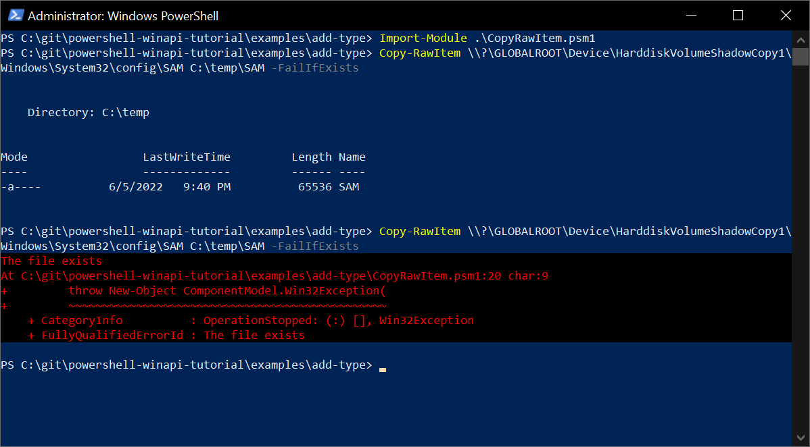

# Use the Add-Type Cmdlet that Calls the Win32 API Function

The [Add-Type](https://docs.microsoft.com/en-us/powershell/module/microsoft.powershell.utility/add-type) cmdlet adds a specified .NET class to a PowerShell session. This topic demonstrates how to use this cmdlet to access the [CopyFile](https://docs.microsoft.com/en-us/windows/win32/api/winbase/nf-winbase-copyfile) function declared in the _kernel32.dll_ library.

## Basic Implementation

Consider the script that calls the `CopyFile` function:

```ps1 title="PowerShell"
--8<-- "examples/add-type/CopyItemSimple.ps1"
```

This script does the following:

* The `$MethodDefinition` variable contains the С# method definition that matches the C++ signature of `CopyFile`.

    ??? info "Expand to see the details"

        ```cpp title="C++ signature"
        BOOL CopyFile(
            [in] LPCTSTR lpExistingFileName,
            [in] LPCTSTR lpNewFileName,
            [in] BOOL    bFailIfExists
        );
        ```
        ```cs title="C# definition"
        --8<-- "examples/add-type/CopyFile.cs"
        ```

        The [DllImport](https://docs.microsoft.com/en-us/dotnet/api/system.runtime.interopservices.dllimportattribute) attribute indicates that the `CopyFile` method is exposed by the _kernel32.dll_ library as a static entry point.


        Note the correct translation of C++ parameter types to corresponding .NET types:

        | C/C++ Type | .NET Type |
        |------------|-----------|
        | BOOL       | bool      |
        | LPCTSTR    | string    |

* The `Add-Type` cmdlet creates the `Kernel32` class containing the `CopyFile` method defined at the previous step.

* The last line of code calls the `Kernel32::CopyFile` method to copy the _calc.exe_ file from _Windows\System32_ folder to the desktop.

## Further Improvements

* It may be inconvenient to edit C# code as a string inside the PowerShell script. You can save the C# code to a separate file (e.g., _CopyFile.cs_) and get the file content using the [Get-Content](https://docs.microsoft.com/en-us/powershell/module/microsoft.powershell.management/get-content) cmdlet.
* You can declare the `Copy-RawItem` commandlet in a [custom PowerShell module file](https://docs.microsoft.com/en-us/powershell/scripting/developer/module/how-to-write-a-powershell-script-module) --- to make your code reusable.
* You can implement error handling --- throw an exception when `CopyFile` fails.

The code below demonstrates the _CopyRawItem.psm1_ module implementation:

```psm1 title="PowerShell Module"
--8<-- "examples/add-type/CopyRawItem.psm1"
```

You can import this module and call `Copy-RawItem` from your script as follows:

```ps1 title="PowerShell"
--8<-- "examples/add-type/CopyRawItem.ps1"
```

Here, the security account manager database file is copied from the [volume shadow copy](https://docs.microsoft.com/en-us/windows/win32/vss/volume-shadow-copy-service-portal) to a temporary folder (which is impossible when using standard [Copy-Item](https://docs.microsoft.com/en-us/powershell/module/microsoft.powershell.management/copy-item) commandlet). If you run `Copy-RawItem` twice, you will see "The file exists" error:



!!! Tip
    If you receive the "Access is denied" error when accessing the shadow copy, run your PowerShell session as administrator.

!!! Note
    You can get the complete code demonstrated here at GitHub: [powershell-winapi-tutorial/examples/add-type](https://github.com/konstantinbelyakov/powershell-winapi-tutorial/tree/main/examples/add-type).
